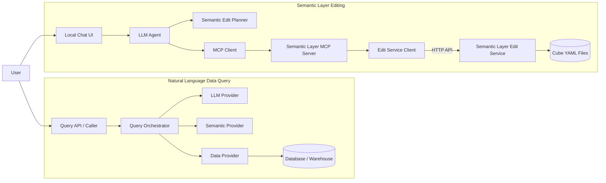

# MetisOne System Architecture

This document describes the current system boundaries, major modules, runtime
flows, and extension points of MetisOne AI Platform. The core goal of the
project is to build a modular AI Knowledge / BI platform where the LLM,
Semantic Layer, database providers, and tool communication mechanisms can be
replaced independently.

> **For AI agents**: This document is also the codebase entry point. Before
> changing code, read "Agent Quick Context", "Code Navigation", "Dependency
> Rules", and the tests related to the task. This document describes the
> current repository facts; product requirement documents describe goals; code
> and tests describe implemented behavior. If these sources conflict, call out
> the conflict instead of silently guessing.

This document is based on project version `0.1.0`. The code requires Python
`>=3.11`.

## 0. Agent Quick Context

If the context window is limited, understand these facts first:

1. The system has two separate flows: **data querying** and **Semantic Layer
   editing**. Do not mix the LLM interfaces from these two flows.
2. The query flow entry point is `QueryOrchestrator.ask()`. It depends on
   `LLMProvider`, `SemanticProvider`, and `DataProvider`.
3. The recommended edit entry point is local
   `LocalLLMSemanticEditAgent.handle()`. It plans through
   `SemanticEditPlanner` and executes through `MCPClient`.
4. The current `MCPClient` and `MCPServer` are in-process implementations, not
   independent standard-protocol MCP services.
5. Only the `Semantic Layer Edit Service` on Ubuntu writes Cube YAML files. The
   local agent does not access YAML files directly.
6. `semantic_layer/` is the source of truth for new Semantic Layer code.
   `providers/semantic.py` and `providers/cube_core/` are mainly legacy import
   compatibility wrappers.
7. `edit_service/chat_agent.py` and `/v1/chat` are the earlier service-side
   rule parser path, not the recommended OpenAI + MCP path.
8. Factories currently select implementations only. The project does not yet
   use a dependency injection container or plugin discovery mechanism.
9. Cross-module results should remain structured: query uses dataclasses,
   editing uses `ToolCall` / `ToolResult`, and HTTP uses Pydantic schemas.
10. Permissions, filter policy, alerts, audit, rollback, and standard remote
    MCP are not implemented yet. Do not assume they exist.

### 0.1 Source Of Truth Priority

External agents should verify behavior in this order:

1. The relevant module abstractions and data models.
2. The current concrete implementation.
3. The behavior covered by automated tests.
4. This document and README.
5. Product requirements or future planning documents.

This document is for fast navigation and understanding. After code changes,
update the relevant sections when architecture facts change.

## 1. Architecture Principles

- **Interface first**: modules depend on abstract contracts, not directly on a
  specific product.
- **Loose coupling**: LLM, Semantic Layer, Data Provider, and MCP transport can
  be replaced independently.
- **Frontend/backend separation**: the local Chat UI communicates with the
  remote Semantic Layer Edit Service through APIs.
- **Structured data first**: modules exchange explicit data models instead of
  relying on free-form text.
- **Progressive evolution**: the current implementation stays lightweight while
  preserving boundaries for permissions, filters, alerts, and independent
  service deployment.

## 2. Overall Architecture

MetisOne currently has two main business flows:

1. **Natural language data query flow**: converts a user question into query
   intent, SQL, and structured results.
2. **Semantic Layer edit flow**: converts a natural language change request
   into tool calls and safely updates Cube YAML.



## 3. Natural Language Query Flow

The query entry point receives a `QueryRequest`. `QueryOrchestrator`
coordinates three providers:

```text
QueryRequest
  -> LLMProvider.generate_intent()
  -> QueryIntent
  -> SemanticProvider.compile()
  -> CompiledQuery
  -> DataProvider.execute()
  -> QueryResult
  -> QueryResponse
```

### 3.1 Query Orchestrator

`QueryOrchestrator` only handles flow orchestration. It does not contain a
specific LLM, Semantic Layer, or database implementation. Providers are passed
through the constructor, so implementations can be replaced without changing
the orchestration logic.

### 3.2 LLM Provider

`LLMProvider` converts a natural language question into a structured
`QueryIntent`.

Current implementations:

- `RuleBasedLLMProvider`: used for local development and tests.
- `OpenAIChatLLMProvider`: calls an OpenAI-compatible Chat Completions API.

### 3.3 Semantic Provider

`SemanticProvider` provides model discovery and query compilation:

- `list_models()`: returns available semantic models.
- `get_model()`: reads a specific model.
- `compile()`: compiles a `QueryIntent` into a `CompiledQuery`.

Current implementations:

- `NativeSemanticProvider`: MetisOne compiles SQL directly.
- `CubeSemanticProvider`: uses Cube Semantic Layer through the Cube API.

### 3.4 Data Provider

`DataProvider` executes an already compiled query and returns a unified
`QueryResult`.

Current implementations:

- `PostgreSQLDataProvider`: executes PostgreSQL queries.
- `InMemoryDataProvider`: used for tests and local development.

Future MySQL, Snowflake, BigQuery, and other implementations can be added
without changing the orchestrator.

## 4. Semantic Layer Edit Flow

The edit flow runs in two deployment environments:

```text
Local development machine
  Local Chat UI
  -> LLM Agent
  -> SemanticEditPlanner
  -> MCPClient
  -> SemanticLayerEditMCPServer
  -> SemanticEditServiceClient

Ubuntu / Cube server
  Semantic Layer Edit Service
  -> CubeYamlRepository
  -> CubeSemanticLayerEditor
  -> Cube YAML files
  -> optional compile command
```

### 4.1 Local Chat UI

The Chat UI only collects natural language requests and displays execution
results. It does not edit YAML directly and does not need access to the Ubuntu
file system.

### 4.2 LLM Agent And Planner

`LocalLLMSemanticEditAgent` is responsible for:

1. Fetching available tools from the MCP client.
2. Reading the model context needed by the planner.
3. Calling `SemanticEditPlanner` to create one or more `ToolCall` objects.
4. Executing tools sequentially and summarizing `ToolResult` objects.

`LLMPlannerFactory` currently supports:

- `OpenAISemanticPlanner`: uses OpenAI to convert natural language into a tool
  call plan.
- `RuleBasedSemanticPlanner`: deterministic development fallback when no API
  key is available.

### 4.3 MCP Boundary

The MCP layer defines stable `MCPClient`, `MCPServer`, `ToolCall`, and
`ToolResult` contracts. Semantic Layer tools include model reading,
Measure/Dimension/Join CRUD, and compile checks.

The current MCP implementation is **in-process communication**:

```text
InProcessMCPClient -> SemanticLayerEditMCPServer
```

It is already isolated behind interfaces and factories, but it is not yet an
independent standard MCP service running through stdio, SSE, or Streamable
HTTP. When a standard MCP transport is added later, the Chat UI and Planner
should not need to know the transport details.

### 4.4 Semantic Layer Edit Service

The Edit Service is a FastAPI service deployed on the Cube server. It is
responsible for:

- Bearer token validation.
- Converting structured CRUD requests into YAML edit operations.
- Restricting file access to the configured Cube model directory.
- Optionally running a Cube compile command to validate models.
- Converting errors into explicit HTTP responses.

The LLM does not generate or overwrite entire YAML files. It calls smaller
structured tools, which reduces the risk of incorrect edits.

## 5. Main Code Directories

```text
src/metisone_ai_platform/
|-- core/                         # Query request, intent, SQL, and result models
|-- orchestrator/                 # Natural language query orchestration
|-- providers/                    # LLM and database providers; compatibility entry points
`-- semantic_layer/
    |-- contracts.py              # SemanticProvider contract
    |-- models.py                 # Metric, Dimension, Join, and related models
    |-- native_provider.py        # Native Semantic Provider
    |-- cube_core/                # Cube API provider
    |-- cube_yaml/                # YAML repository, codec, editor, compiler
    |-- edit_service/             # Remote FastAPI service and HTTP client
    |-- llm/                      # Edit planner contracts, implementations, factory
    |-- mcp/                      # MCP contracts, tool server, client, factory
    `-- client_app/               # Local Chat UI and Agent
```

`providers/semantic.py` and `providers/cube_core/` are thin wrappers for old
import paths. New Semantic Layer code should be placed under
`semantic_layer/` first.

## 6. Core Data Contracts

The query flow uses these structured objects:

| Object | Purpose |
| --- | --- |
| `QueryRequest` | User question, preferred model, and result limit |
| `QueryIntent` | Metrics, dimensions, filters, and time range |
| `CompiledQuery` | SQL, parameters, and database dialect |
| `QueryResult` | Columns, rows, and row count |
| `QueryResponse` | Unified success or error response |

The edit flow uses these objects:

| Object | Purpose |
| --- | --- |
| `LLMPlan` | One or more tool calls produced by the planner |
| `ToolCall` | Tool name and structured arguments |
| `ToolResult` | Tool execution status, data, or error |

These contracts are the stable boundaries that module replacements should
preserve.

## 7. Module Replacement Strategy

| Module To Replace | Stable Interface | Current Implementations | Replacement Direction |
| --- | --- | --- | --- |
| Query LLM | `LLMProvider` | Rule-based, OpenAI | Azure OpenAI, local models |
| Semantic Layer | `SemanticProvider` | Native, Cube | dbt Semantic Layer, LookML adapter |
| Database | `DataProvider` | PostgreSQL | MySQL, Snowflake, BigQuery |
| Edit Planner | `SemanticEditPlanner` | OpenAI, Rule-based | Other agents or models |
| MCP communication | `MCPClient` / `MCPServer` | In-process | stdio, Streamable HTTP |
| YAML storage | Repository boundary | Local file system | Git, object storage, config service |

When adding an implementation, prefer implementing an existing abstraction and
selecting it through a factory or dependency injection. Avoid adding
product-specific logic to the Orchestrator, Agent, or UI.

## 8. Deployment And Trust Boundaries

```text
Developer Machine                         Ubuntu / Cube Server
-----------------                         --------------------
Browser
  -> Local Chat UI :8090
  -> OpenAI API
  -> MCP in-process tools
  -> HTTP + Bearer Token ----------------> Edit Service :8088
                                             -> Cube model directory
                                             -> optional Cube compile
```

Security boundaries:

- The OpenAI API key is stored only in the local Agent environment.
- The Edit Service token authenticates the local client to the Ubuntu service.
- The Ubuntu service account needs read/write permission for the Cube model
  directory.
- Cube YAML files do not need to be copied to the local development machine.
- Production deployments should add TLS, secret management, audit logs, and
  finer-grained authorization in front of the Edit Service.

## 9. Current Scope

Implemented:

- Modular query providers and Query Orchestrator.
- PostgreSQL query execution.
- Native and Cube Semantic Providers.
- Structured editing for Cube YAML.
- Local Chat UI, OpenAI/rule-based Planner, and MCP tool boundary.
- Independently deployable Semantic Layer Edit Service.

Not implemented yet:

- Users, roles, row/column-level permissions, and filter policy.
- Alert definitions, scheduling, and email notifications.
- Standard remote MCP transport.
- Agent approval, rollback, audit, and multi-step dynamic replanning.
- Production-grade API gateway, task queue, and observability.

Recommended evolution order: finish standard MCP transport and YAML change
audit first, add permission policies next, then implement alerts and the async
task system.

## 10. Exact Call Paths

### 10.1 Query Request

```text
caller
  -> QueryOrchestrator.ask(QueryRequest)
  -> SemanticProvider.list_models()
  -> LLMProvider.generate_intent(request, models)
  -> SemanticProvider.compile(intent)
  -> DataProvider.execute(compiled_query)
  -> QueryResponse
```

`QueryOrchestrator.ask()` catches all exceptions and returns
`QueryResponse(status="error", error=...)`. It does not re-raise exceptions to
the caller.

### 10.2 Recommended Local Edit Request

```text
POST /local-chat
  -> client_app.app.local_chat()
  -> SemanticEditServiceClient(service_url, api_token)
  -> MCPFactory.semantic_edit_client(edit_client)
  -> LLMPlannerFactory.create()
  -> LocalLLMSemanticEditAgent.handle(message)
  -> MCPClient.list_tools()
  -> MCP tool: list_cubes                    # Load planner context
  -> SemanticEditPlanner.plan(...)
  -> MCPClient.call_tool(...)                # May execute multiple ToolCalls
  -> SemanticLayerEditMCPServer handler
  -> SemanticEditServiceClient HTTP request
  -> Ubuntu Edit Service endpoint
  -> CubeSemanticLayerEditor
  -> CubeYamlRepository.save()
```

The Agent currently generates a complete `LLMPlan` once and then executes all
calls sequentially. It does not call the LLM again to replan based on earlier
tool results, and it does not automatically roll back already successful
calls.

### 10.3 Legacy Service-Side Chat Path

```text
POST /v1/chat
  -> RuleBasedSemanticEditAgent
  -> CubeSemanticLayerEditor
  -> CubeYamlRepository
```

This path is kept for compatibility and deterministic debugging. New natural
language capability should be added to the local Planner + MCP path unless the
requirement explicitly asks for service-side rule parser changes.

## 11. Code Navigation

| Task Area | Read First | Related Implementation |
| --- | --- | --- |
| Query data structures | `core/models.py` | `QueryRequest` to `QueryResponse` |
| Query orchestration order | `orchestrator/query_orchestrator.py` | `QueryOrchestrator.ask()` |
| Query LLM interface | `providers/base.py` | `providers/llm.py` |
| Database interface | `providers/base.py` | `providers/data.py` |
| Semantic Provider interface | `semantic_layer/contracts.py` | `native_provider.py`, `cube_core/` |
| Cube semantic models | `semantic_layer/models.py` | Shared by Native/Cube providers |
| Local Chat HTTP entry | `semantic_layer/client_app/app.py` | `ui.py`, `main.py` |
| Local edit Agent | `semantic_layer/client_app/llm_agent.py` | Combines Planner and MCP Client |
| Edit Planner interface | `semantic_layer/llm/contracts.py` | `openai_planner.py`, `rule_based_planner.py` |
| Planner selection | `semantic_layer/llm/factory.py` | `LLMPlannerFactory` |
| MCP data contracts | `semantic_layer/mcp/contracts.py` | `ToolCall`, `ToolResult` |
| MCP tool list and mapping | `semantic_layer/mcp/semantic_edit_server.py` | Tool-to-HTTP-client adapter |
| MCP Client selection | `semantic_layer/mcp/factory.py` | Currently returns `InProcessMCPClient` |
| Remote HTTP Client | `semantic_layer/edit_service/client.py` | URL, auth, request, error mapping |
| Ubuntu API routes | `semantic_layer/edit_service/app.py` | FastAPI endpoints |
| Service configuration | `semantic_layer/edit_service/config.py` | Environment variables to `EditServiceConfig` |
| YAML file boundary | `semantic_layer/cube_yaml/repository.py` | Path resolution, read, save |
| YAML structural edits | `semantic_layer/cube_yaml/editor.py` | Measure/Dimension/Join CRUD |
| YAML codec | `semantic_layer/cube_yaml/yaml_codec.py` | PyYAML or simplified fallback |
| Cube compile command | `semantic_layer/cube_yaml/compiler.py` | Subprocess execution and result |

### 11.1 Process Entry Points

| Process | ASGI Entry Point | Default Port |
| --- | --- | --- |
| Local Chat Client | `metisone_ai_platform.semantic_layer.client_app.main:app` | `8090` |
| Ubuntu Edit Service | `metisone_ai_platform.semantic_layer.edit_service.main:app` | `8088` |

Ports are selected by the startup command. They are not hardcoded in the Python
modules.

## 12. Edit API And MCP Tool Mapping

Except for `/health`, Edit Service endpoints require a Bearer token. Core
mapping:

| MCP Tool | HTTP Method | Edit Service Path |
| --- | --- | --- |
| `list_cubes` | GET | `/v1/cubes` |
| `get_cube` | GET | `/v1/cubes/{cube}` |
| `list_measures` | GET | `/v1/cubes/{cube}/measures` |
| `create_measure` | POST | `/v1/cubes/{cube}/measures` |
| `modify_measure` | PATCH | `/v1/cubes/{cube}/measures/{name}` |
| `delete_measure` | DELETE | `/v1/cubes/{cube}/measures/{name}` |
| `list_dimensions` | GET | `/v1/cubes/{cube}/dimensions` |
| `create_dimension` | POST | `/v1/cubes/{cube}/dimensions` |
| `modify_dimension` | PATCH | `/v1/cubes/{cube}/dimensions/{name}` |
| `delete_dimension` | DELETE | `/v1/cubes/{cube}/dimensions/{name}` |
| `list_joins` | GET | `/v1/cubes/{cube}/joins` |
| `create_join` | POST | `/v1/cubes/{cube}/joins` |
| `modify_join` | PATCH | `/v1/cubes/{cube}/joins/{name}` |
| `delete_join` | DELETE | `/v1/cubes/{cube}/joins/{name}` |
| `compile` | POST | `/v1/compile` |

The current MCP tool schema is a simplified internal format:

```json
{
  "name": "create_measure",
  "description": "Create a measure in a cube.",
  "parameters": {
    "cube": "string",
    "name": "string",
    "sql": "string",
    "type": "string",
    "title": "string?"
  }
}
```

It is not full JSON Schema. When standard MCP is implemented, add a protocol
adapter. Existing planners and business tools should not need to handle
transport details directly.

## 13. Configuration Contract

### 13.1 Local Chat / Agent

| Environment Variable | Required | Default Or Behavior |
| --- | --- | --- |
| `OPENAI_API_KEY` | Required for OpenAI mode | `auto` falls back to rule-based when missing |
| `OPENAI_MODEL` | Optional | `gpt-4.1-mini` |
| `OPENAI_BASE_URL` | Optional | OpenAI Chat Completions endpoint |
| `SEMANTIC_AGENT_MODE` | Optional | `auto`; valid values: `openai`, `rule` |
| `SEMANTIC_EDIT_SERVICE_URL` | Optional | `http://192.168.31.224:8088` |
| `SEMANTIC_EDIT_SERVICE_TOKEN` | Required for protected API calls | No default |

Local UI requests can also send `service_url` and `api_token` directly. These
values take precedence over client environment variable defaults.

### 13.2 Ubuntu Edit Service

| Environment Variable | Required | Purpose |
| --- | --- | --- |
| `METISONE_CUBE_MODEL_DIR` | Required | Cube YAML root directory |
| `METISONE_SEMANTIC_EDIT_TOKEN` | Recommended | Server-side Bearer token |
| `METISONE_CUBE_COMPILE_COMMAND` | Optional | Command executed by `/v1/compile` |
| `METISONE_CUBE_COMPILE_CWD` | Optional | Working directory for the compile command |

The client and server use different environment variable names for the token:
the client uses `SEMANTIC_EDIT_SERVICE_TOKEN`, while the server uses
`METISONE_SEMANTIC_EDIT_TOKEN`. Their values must match.

## 14. Dependency Rules And Invariants

When changing code, preserve these rules:

- `core/` must not depend on UI, FastAPI, concrete databases, or concrete
  Semantic Layer products.
- `QueryOrchestrator` should depend only on provider abstractions and core data
  models.
- `SemanticEditPlanner` only produces `LLMPlan`; it does not call HTTP or write
  files directly.
- `LocalLLMSemanticEditAgent` uses tools only through `MCPClient`.
- The MCP Server adapts tools to the Edit Service Client. It does not parse
  YAML.
- Edit Service routes handle authentication, schemas, and error mapping.
  Business edits belong in `cube_yaml/`.
- The repository must guarantee that target paths stay inside the configured
  model root directory.
- Measures, dimensions, and joins must be written into the matching cube node,
  never to the top level of a YAML document.
- API keys, tokens, DSNs, and other secrets must not be committed in code or
  documentation examples.
- When adding an external provider, keep product SDK details inside the
  concrete adapter.
- When adding fields across boundaries, update data models, adapters, API
  schemas, tool schemas, and tests together.

### 14.1 Error Semantics

- The query flow wraps exceptions in `QueryResponse(status="error")`.
- The MCP Server wraps tool exceptions in
  `ToolResult(success=False, error=...)`.
- The HTTP Client converts non-2xx responses into `RuntimeError` and preserves
  the status code and response body.
- The Edit Service maps `FileNotFoundError` to 404, `ValueError` to 400, and
  unhandled exceptions to 500.
- The local Chat API maps configuration `ValueError` cases to 400. Remote or
  execution failures usually map to 502.

## 15. Extension Playbook

### 15.1 Add A Database Provider

1. Keep or extend the `DataProvider` contract in `providers/base.py`.
2. Implement `execute(CompiledQuery) -> QueryResult` in a dedicated module.
3. Put the database SDK in a `pyproject.toml` optional dependency.
4. Add tests for successful queries, parameter binding, empty results, and
   database errors.
5. Do not add database type checks to `QueryOrchestrator`.

### 15.2 Add A Semantic Provider

1. Implement `SemanticProvider` from `semantic_layer/contracts.py`.
2. Implement `list_models()`, `get_model()`, and `compile()`.
3. Convert vendor responses into MetisOne `SemanticModel` and `CompiledQuery`.
4. Keep vendor auth, URL, and dialect logic inside that provider directory.
5. Add tests for metadata mapping and query compilation.

### 15.3 Add An LLM Edit Planner

1. Implement `SemanticEditPlanner.plan()`.
2. Use only the provided tool schema. Do not hardcode HTTP endpoints inside the
   planner.
3. Return validated `LLMPlan` and `ToolCall` objects.
4. Add an explicit mode in `LLMPlannerFactory`.
5. Test no-call, single-call, multi-call, unknown-tool, and invalid-argument
   cases.

### 15.4 Add An MCP Tool

1. Define the tool in `SemanticLayerEditMCPServer.list_tools()`.
2. Register its handler in `_handlers`.
3. If it needs a remote operation, add a method to `SemanticEditServiceClient`.
4. Add Pydantic schemas and routes to the Edit Service.
5. Put the actual business logic in the editor/repository layer.
6. Add tests for MCP mapping, HTTP Client behavior, Service behavior, and the
   business layer.

### 15.5 Replace In-Process MCP With Standard Remote MCP

1. Keep `MCPClient` and business `ToolCall` / `ToolResult` contracts.
2. Add a standard MCP server process and protocol adapter.
3. Add a stdio or Streamable HTTP client implementation.
4. Extend `MCPFactory` to select transport based on configuration.
5. Do not change the business responsibilities of the Chat UI, Planner, or YAML
   Editor.

## 16. Test Map

| Test File | Coverage |
| --- | --- |
| `tests/test_query_orchestrator.py` | Query provider orchestration and structured results |
| `tests/test_cube_core_provider.py` | Cube metadata, query compilation, and result mapping |
| `tests/test_cube_yaml_editor.py` | Measure/Dimension/Join CRUD and nested cube writes in YAML |
| `tests/test_edit_service.py` | Edit Service auth, CRUD, compile, and legacy Chat API |
| `tests/test_edit_service_client.py` | HTTP Client URL, payload, and request behavior |
| `tests/test_client_app.py` | Local UI and local edit invocation |
| `tests/test_semantic_layer_mcp.py` | MCP tool mapping and LLM Agent execution |

Run all tests:

```bash
python -m pytest
```

Install development and service dependencies:

```bash
pip install -e ".[service,dev]"
```

When changing a layer, run at least the tests for that layer. When changing
contracts, routes, or cross-module data fields, run the full test suite.

## 17. Agent Pre-Change Checklist

1. Determine whether the task belongs to the query flow or the edit flow.
2. Find the abstraction contract and source of truth for the capability.
3. Check whether a legacy compatibility path exists, so you do not only modify
   old code or create inconsistent behavior across paths.
4. Check whether data crosses Planner, MCP, HTTP, and Editor layers.
5. Preserve existing structured returns and error semantics.
6. Add or update tests closest to the behavior.
7. Update README usage and this document when architecture facts change.
8. Clearly state any tests that were not run and any remaining limitations.
